#   How to install Stable Diffusion Models on Google Collab and play.

Hello everyone, today we are going to learn how to install some of the amazing models of **Generative AI** to generation of images. In particular install the models on **Google Collab** with a good GPU.

We are going to build some pictures by using **Diffusion Models** like the following pictures:


There are tons of models out there to generate images from a text, the name of those models due to the architecture where comes from are called **Stable Diffusion Models.**

Fortunately there are many hubs of models where enthusiastic people upload their models to public and we can download and use as we need.

Among the most famous sites to download the models are:

[https://huggingface.co/](https://huggingface.co/models?pipeline_tag=text-to-image&sort=trending)

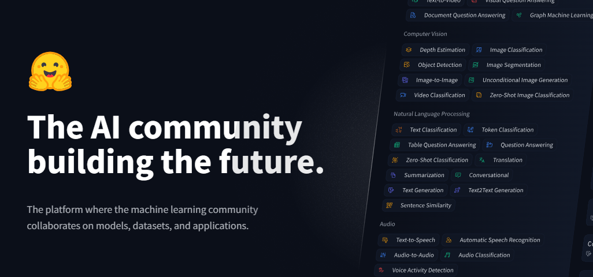

https://civitai.com/

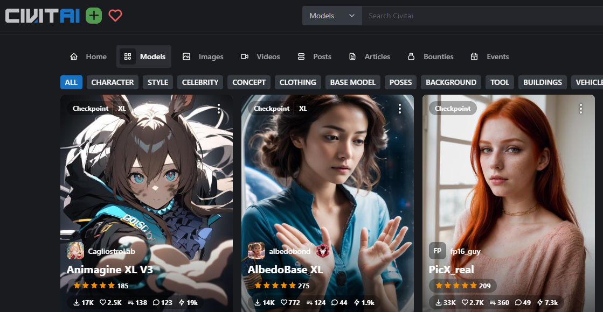

In this tutorial we are going to learn how to download the models and how to run the models.

What do you need :

- A **Google drive** Account (free) : [create or login here](https://www.google.com/intl/fr/drive/),
- **Automatic 111 Notebook** 

The Automatic 1111 Notebook is a Web UI that uses the powerful IA scripts. 

 First We are going to run the models and un further blog post, we will discuss with attention how to load manually in a simple python code.

## Step 1 - Load the Notebook

First let us open the following notebook [here](https://colab.research.google.com/github/TheLastBen/fast-stable-diffusion/blob/main/fast_stable_diffusion_AUTOMATIC1111.ipynb)

Once you opened it, click on **Copy to Drive** 

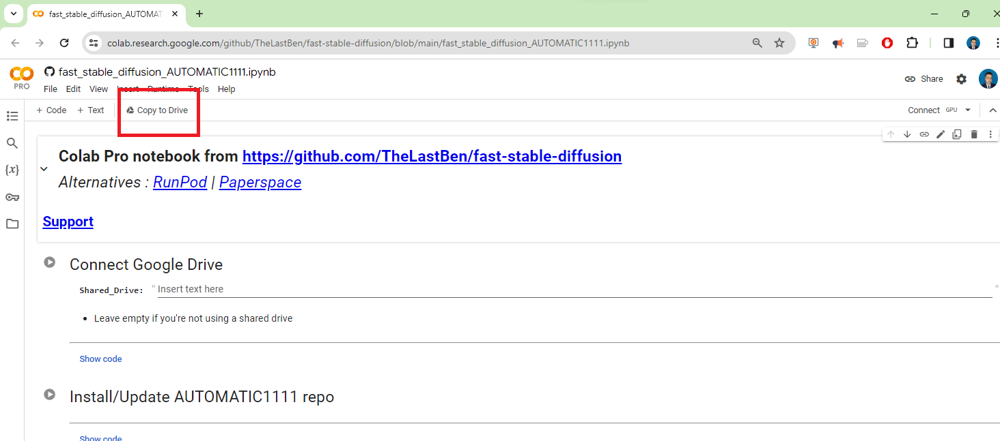

Then will be requested to log in your Google Drive Account (your mobile may be required for confirmation)

## Step 2 - Change Runtime Type

In the top left menu of the notebook we click the  small down arrow icon and click change Runtime Type. 

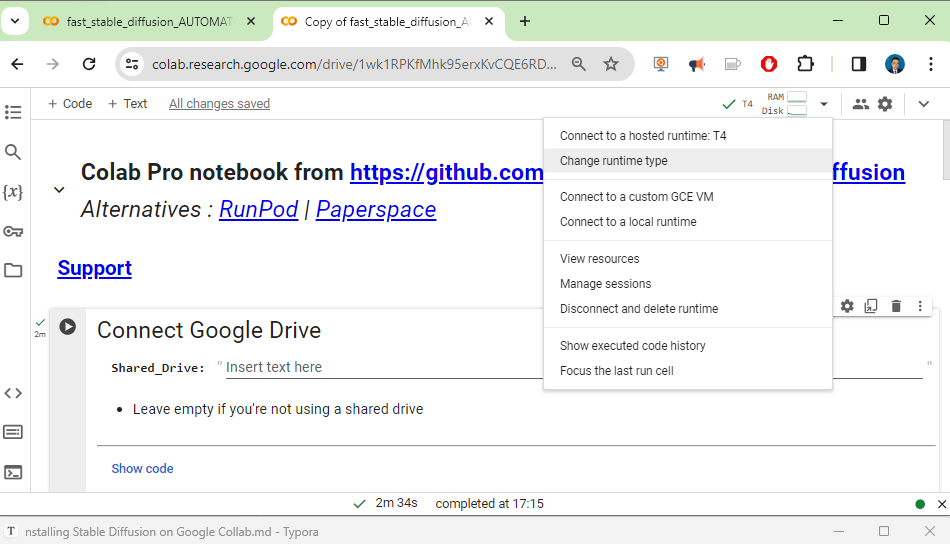

We choose a reasonable Hardware accelerator appropiate for the model that we are going to run, in this demo we will choose the simplest **T4 GPU**, In this demo I am using **Colab Pro** and you can choose up to **A100 GPU** with **High Ram** if you want a great specs for your Images Generation.

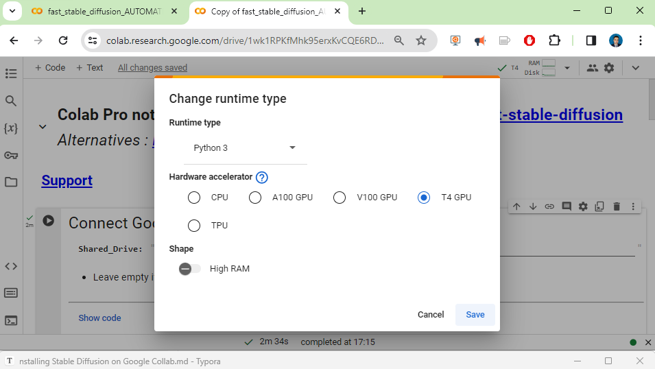

More info about GPUs [here](https://research.google.com/colaboratory/faq.html#gpu-availability).

## Step 3 - Running the Notebook

When you run the first cell will ask to access to you Google Drive files, we will require you permission to connect your Colab Notebook to your Drive account


and we connect with our google drive


then you can run the cell Install Update Automatic and Requirements

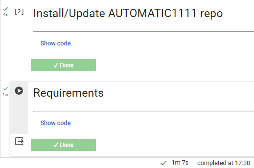

## Step 4 Model Download

The Model Download block needs special attention, since this is where you can customize your Stable Diffusion.

Due to I would like to do a simple test let us use Temp Storage.

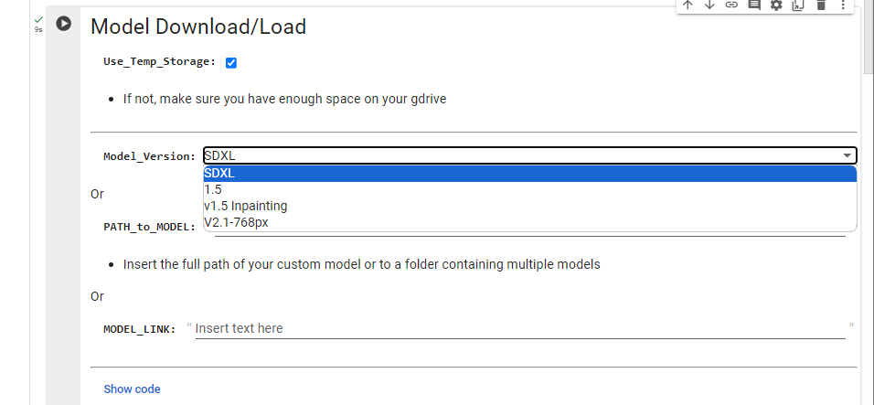

If would want use the default model, you can choose, one of the previous models listed there.


## Step 5   Download Model  

If you want to add other models, you can now re-run this Model block , to add other *Models* engine. These models engine are to be downloaded from  **Hugging Face** or **Civitai** 

### Downloading from Hugging Face

You can download your models from Hugging face , you may search by name or scroll all of them. [here](https://huggingface.co/models?pipeline_tag=text-to-image&sort=downloads)

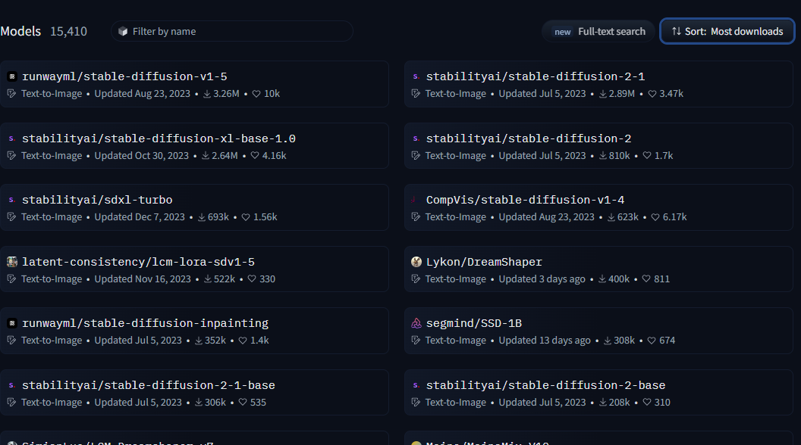

Choose a model that you like, look for a big file. It can have a lot of variant name ending with fp16, fp32, safetensor, DM++. These models are designed to convert textual information into images or generate images based on textual input. They fall under the broader category of generative models, where the goal is to generate new data samples that resemble a given input.

There are different formats among them

1. **fp16 and fp32:**
   - These terms refer to the precision of numerical representation in the model.
   - **fp16:** Stands for 16-bit floating-point precision. It uses half-precision floating-point format, which can accelerate training and inference on hardware that supports it. However, it may result in some loss of precision compared to higher precision formats.
   - **fp32:** Stands for 32-bit floating-point precision, which is a standard precision format. It provides more precision compared to fp16 but may require more memory and computation resources.
2. **safetensor:**
   - This term is not standard, and its meaning may depend on the context in which it is used. It might refer to a system or method designed to enhance the safety or reliability of handling tensors (data structures used in deep learning frameworks) in machine learning models.
3. **DM++:**
   - Without specific context, it's challenging to pinpoint the exact meaning of "DM++." However, it might refer to an extension or improvement in a particular deep learning model or framework. The "++" often implies an advancement or an enhanced version of something.


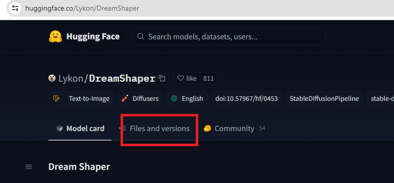

Then you can download the latest version 

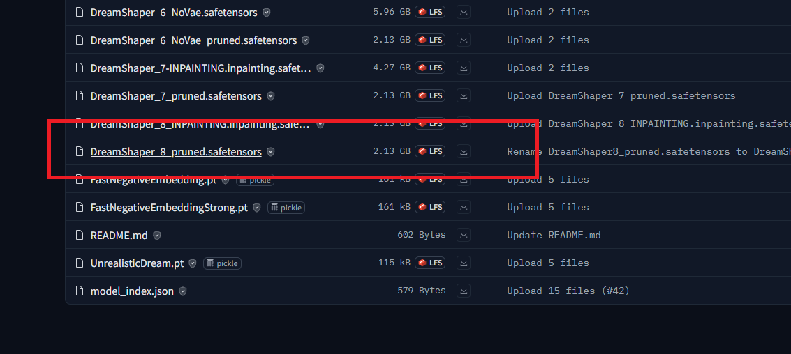

You also can download some of the **Hugging Face** models in from **Civitai.** 

### Downloading from Civitai

There different models that you can choose, choose the one that you like, you can  choose a nice model in the library. It's categorized by theme.

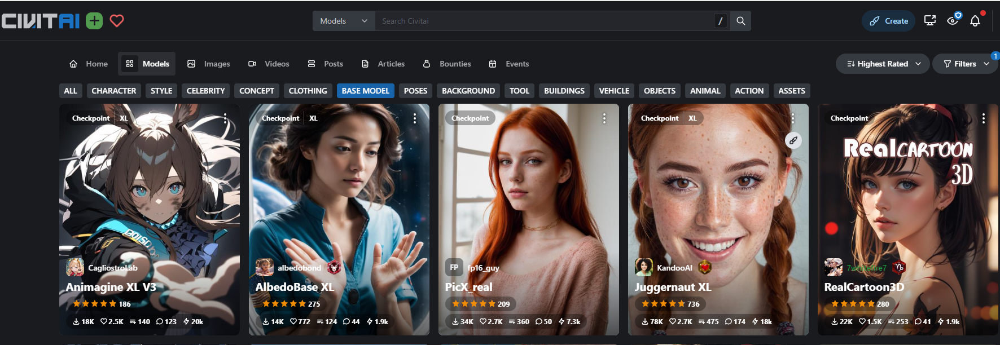


Click on the model that you would like use to create and download it. Read the information about the Model, and if it suits you, Download it.

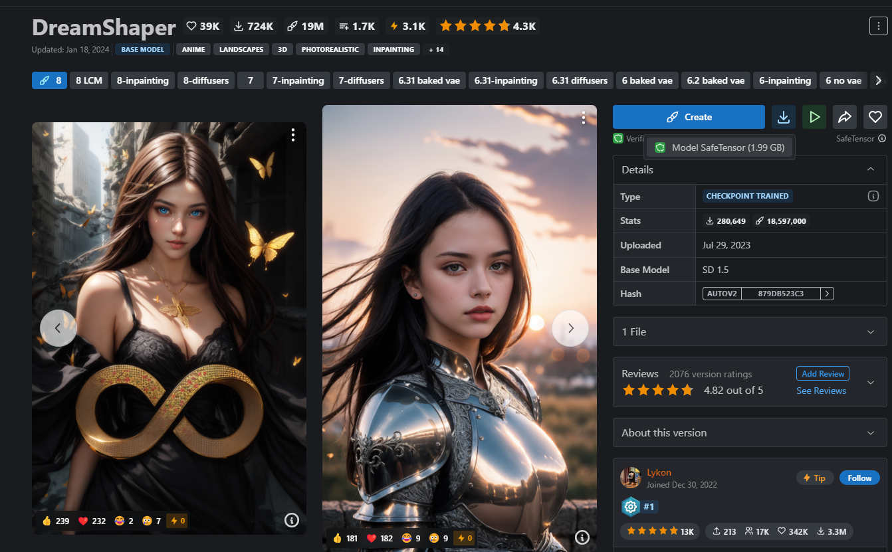

If you want to automatize the downloading procedure  of your favorite models, you can use `civitdl` by installing it

```
pip3 install civitdl
```

We can type this after the cell of requirements

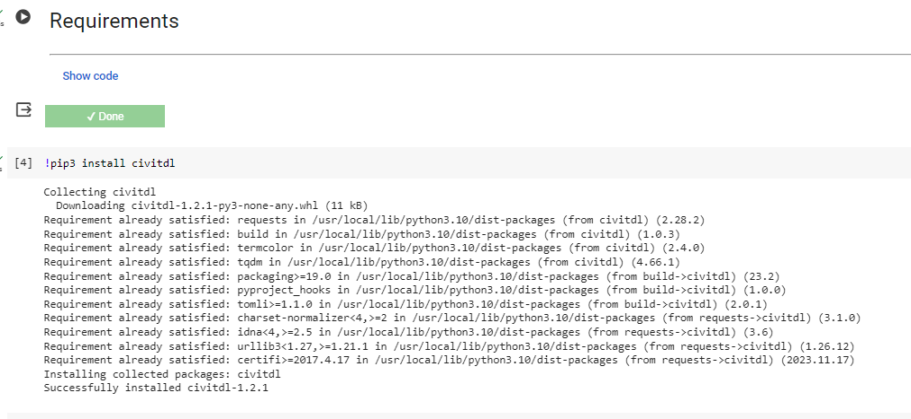

This program can be executed by this syntaxy's  `civitdl batchfile <txt file path> <destination model folder path>`

For example  assuming that you have a model like this:

`https://civitai.com/models/4384/dreamshaper`

```
civitdl batchstr "https://civitai.com/models/4384/dreamshaper," ./Models
```


Or if you want to download multiple models for example you can  a create a **batchfile.txt** with a list of the models that you want to download and use , for example

```
text = '''https://civitai.com/models/140737/albedobase-xl,
https://civitai.com/models/46422/juggernaut,
https://civitai.com/models/241415/picxreal,
https://civitai.com/models/97744/realcartoon-realistic
'''
models = text.split('\n')
with open('batchfile.txt', 'w') as file:
    for model in models:
        file.write(model + '\n')
```

the previous program download the models like

```
civitdl batchfile batchfile.txt ./Models
```

## Step 6 Copy the folder path

Now go back to your Colab space (it should be the tab before) , and right-click on the Model Folder to copy the full path of the folder


We copy the path of the folder Model.

Now you can fill the required field **Path_to_MODEL** in the block `Model Download`, and run the script with the play icon.

It will load all the models that are in the Model folder. You're done with the Models import.

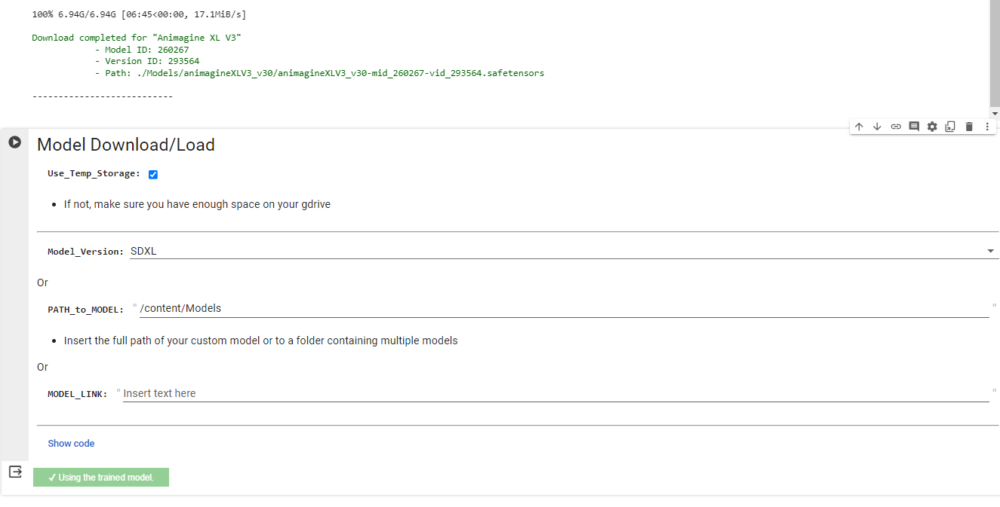

then you run the latest two cells without changing something


and finally


and you got

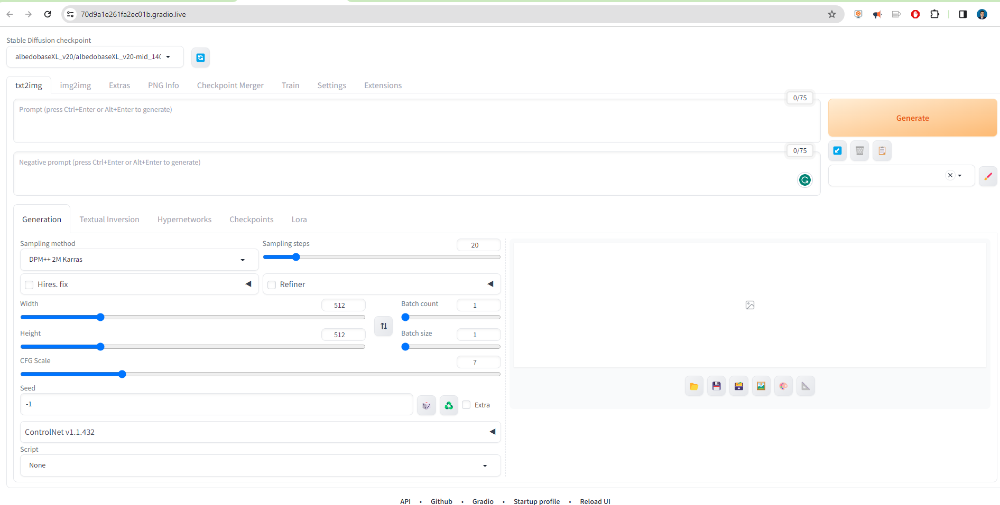

## Step 7 Playground Generation - Prompting

This is one of most funny and interesting part of this demo, is the generation of  images and the improvement.

Once we have the previous screen, let try to play with this prompt

```
A woman wearing an ais-metal bikini, standing on a tropical beach 
```

Let us just to reproduce the following image for yours, let use the model `albedobaseXL_v20/albedobaseXL_v20-mid_140737-vid_281176.safetensors [a928fee35b]` and we keep the default settings we set only 

**seed** =`1922608063` 

as follows:

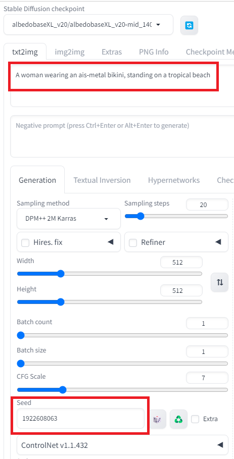

Then when we click Generate


we got the following picture

.png)

```
An woman wearing an ais-metal bikini, standing on a tropical beach
Steps: 20, Sampler: DPM++ 2M Karras, CFG scale: 7, Seed: 1922608063, Size: 512x512, Model hash: a928fee35b, Model: albedobaseXL_v20-mid_140737-vid_281176, Version: v1.7.0
```

as you see is not perfect the imagen and is blurred is not great picture, however, it is possible improve it.

Below of the picture you can  see the properties of the picture to be generated


Let us try to improve this part.

## Step 8  - Sampling Methods and  Lora

First let ass improve the previous model with another model called **Metallic Iridescence SDXL** you can download [here](https://civitai.com/models/270394/metallic-iridescence-sdxl?modelVersionId=304805)

](assets/images/posts/README/image-20240120223800707.png)

With this model we can download it `Metallic_Iridescence_SDXL.safetensors`

and paste into the path `/content/gdrive/MyDrive/sd/stable-diffusion-webui/models/Lora`, by uploading

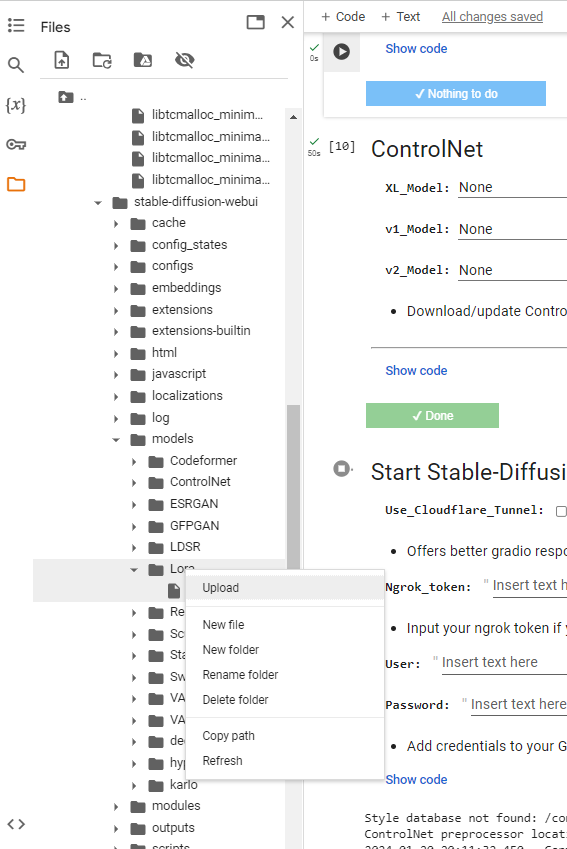

once you uploaded this model, you can  go to the Lora menu and then refresh and you install the add on.

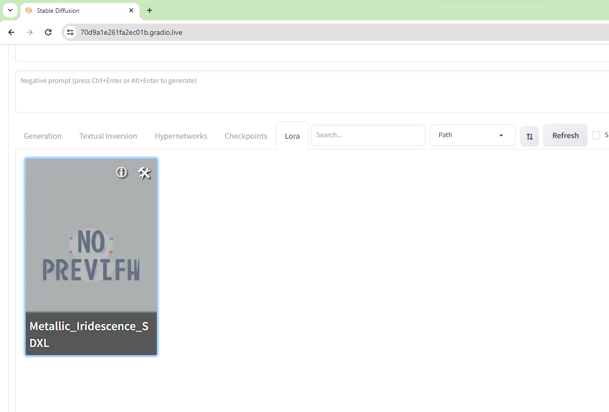

you return back to your Generation menu and change the **Sampling method** to **DPM++ 3M SDE Karras**

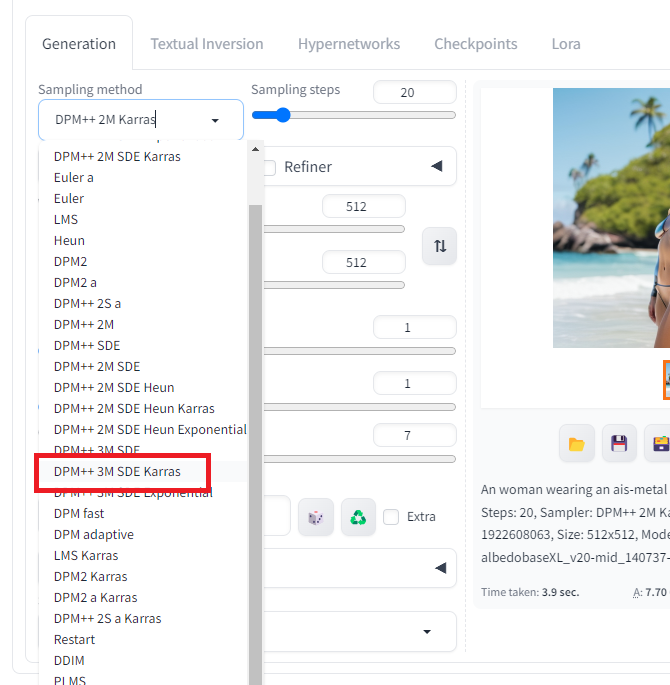

then you change the following parameters:  **Sampling steps** = **42**

.png)

```
A woman wearing an ais-metal bikini, standing on a tropical beach
Steps: 42, Sampler: DPM++ 3M SDE Karras, CFG scale: 7, Seed: 1922608063, Size: 512x512, Model hash: a928fee35b, Model: albedobaseXL_v20-mid_140737-vid_281176, Version: v1.7.0
```

Still you don't see something good, we just changed the Sampler, let us now add the Lora. This is possible now by changing the prompt to

```
A woman wearing an ais-metal bikini, standing on a tropical beach <lora:Metallic_Iridescence_SDXL:0.5>
```

.png)

```
A woman wearing an ais-metal bikini, standing on a tropical beach <lora:Metallic_Iridescence_SDXL:0.5>
Steps: 42, Sampler: DPM++ 3M SDE Karras, CFG scale: 7, Seed: 1922608063, Size: 512x512, Model hash: a928fee35b, Model: albedobaseXL_v20-mid_140737-vid_281176, Lora hashes: "Metallic_Iridescence_SDXL: faec5ae5859d", Version: v1.7.0
```

As you see now **Metallic_Iridescence_SDXL** add some special effects to the previous picture.

## Step 8  - Upscaling and Refiner

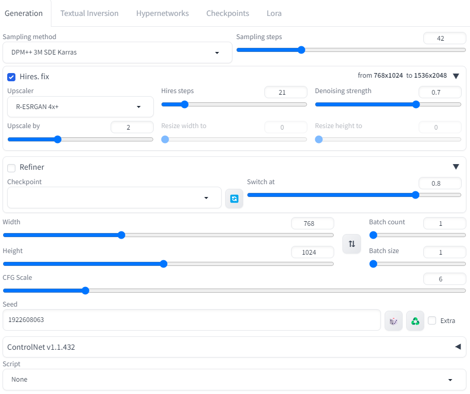

Finally the last  improvment that we will show is the upscaling we enable **Hires. fix** and we add the following parameters:

**Hires steps**:21

**Upscaler:**R-ESRGAN 4x+

**Upscale by**: 1.5

we enable **Refiner** and we add the following parameters:

**Width:**768

**Height:**1024

**CFG Scale**: 6

.png)

```
A woman wearing an ais-metal bikini, standing on a tropical beach <lora:Metallic_Iridescence_SDXL:0.5>
Steps: 42, Sampler: DPM++ 3M SDE Karras, CFG scale: 6, Seed: 1922608063, Size: 768x1024, Model hash: a928fee35b, Model: albedobaseXL_v20-mid_140737-vid_281176, Denoising strength: 0.7, Hires upscale: 2, Hires steps: 21, Hires upscaler: R-ESRGAN 4x+, Lora hashes: "Metallic_Iridescence_SDXL: faec5ae5859d", Version: v1.7.0
```

And finally if you want you can change the resolution 

**Width:**1024

**Height:**768

.png)

```
A woman wearing an ais-metal bikini, standing on a tropical beach <lora:Metallic_Iridescence_SDXL:0.5>
Steps: 42, Sampler: DPM++ 3M SDE Karras, CFG scale: 6, Seed: 1922608063, Size: 1024x768, Model hash: a928fee35b, Model: albedobaseXL_v20-mid_140737-vid_281176, Denoising strength: 0.7, Hires upscale: 2, Hires steps: 21, Hires upscaler: R-ESRGAN 4x+, Lora hashes: "Metallic_Iridescence_SDXL: faec5ae5859d", Version: v1.7.0
```

You can have more details of the beach.

Or just if you want to remove the metalic effect you can change the prompt:

```
A  woman in, sexy bikini standing on a tropical beach 
```

.png)

Or just try with this prompt

```
A  woman , sexy bikini standing on a tropical beach
```

.png)

Moreover you can return back with your favorite metal design as follows:

```
A woman , sexy metalicl bikini standing on a tropical beach <lora:Metallic_Iridescence_SDXL:0.5>
```

.png)

```
A woman , sexy metalicl bikini standing on a tropical beach <lora:Metallic_Iridescence_SDXL:0.5>
Steps: 42, Sampler: DPM++ 3M SDE Karras, CFG scale: 6, Seed: 1922608063, Size: 1024x768, Model hash: a928fee35b, Model: albedobaseXL_v20-mid_140737-vid_281176, Denoising strength: 0.7, Hires upscale: 2, Hires steps: 21, Hires upscaler: R-ESRGAN 4x+, Version: v1.7.0
```

As you see we can improve our pictures by fine tunning the parameters.

**Congratulations!** You have learned how to create amazing pictures by using **Diffusion  Models** in **Google Collab.**